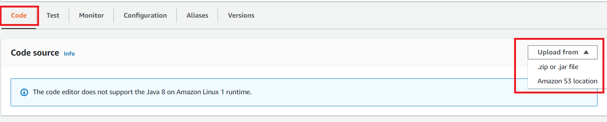
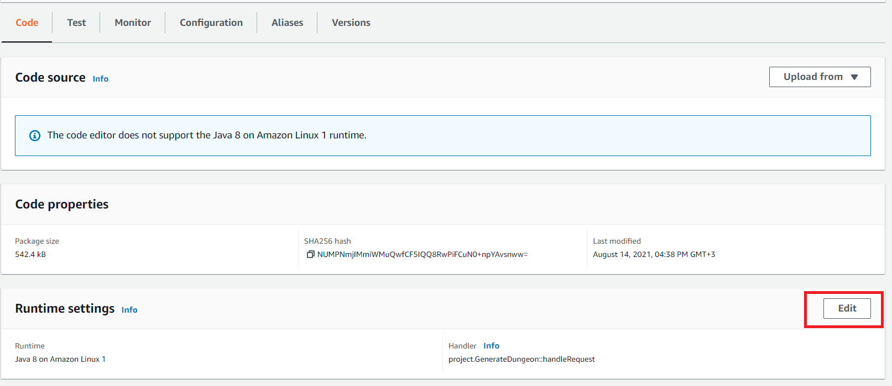
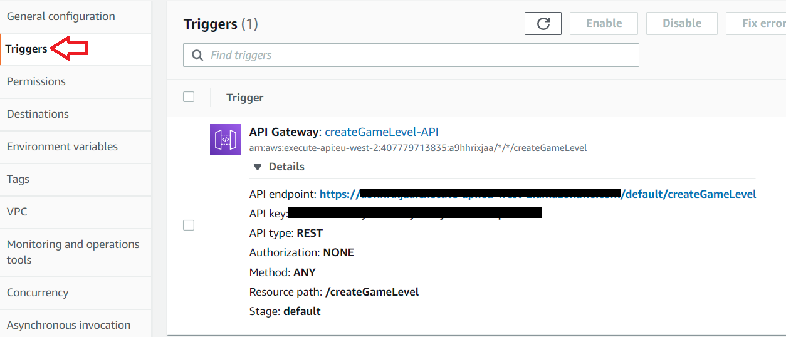

# Final-Project

The final project of my bachelor degree.        
The project is designed to compare the gameplay
and design differences between five algorithms that
create video game levels automatically, using Procedural Generation.
The main goal of the project is to expose the user to levels which are
a product of the algorithms:
    
- Binary Space Partitioning And Random Point Connect.
- Binary Space Partitioning And Binary Space Partitioning.
- Binary Space Partitioning And Drunkard’s Walk.
- Random Room Placement And Random Point Connect.
- Random Room Placement And Drunkard’s Walk.

As a game developer it is vital to deliver an adequate performance for
the game and avoid overloading the players’ computer.
Therefore, the game backend was chosen to reside on the cloud 
[AWS Lambda function](https://github.com/ChenOst/procedural-gen-backend) which does the heavy calculations of all requested
stages of the game.

## Installation 

The full Unity project can be found need to add link [here]()

Follow the instructions in the following manuals:  
1. [Create Lambda function](https://www.youtube.com/watch?v=Hatm94yZ5t8&list=WL&index=17&ab_channel=NKTStudios)
1. [Create API Gateway](https://www.youtube.com/watch?v=5YZZSsYSp88&list=WL&index=17&t=244s&ab_channel=NKTStudios)

#### Connect the backend to Lambda 

Clone the [AWS Lambda function](https://github.com/ChenOst/procedural-gen-backend) project.  
Compile the package into a jar (IDE should have `mvn package` option).  
Go to your Lambda function use the `code` option:
1. click on `upload from` and choose zip or jar file option, search for the jar you just created.
1. Go to the `Run time setting` use `edit`: change `Handler` into: project.GenerateDungeon::handleRequest.
Or any other entry point you wish.

 

 

#### Connect Unity to Lambda: 
Open your API Gateway trigger: 

 

Go to the script: [ConnectToLambda.cs](https://github.com/ChenOst/final-project/blob/main/game/Assets/Scripts/Game%20Manager%20Scripts/Lambda%20Scripts/ConnectToLambda.cs)  
Copy the full `API endpoint` to the `url` and the `API key` to the `header`, as shown below.
```
string url = "API endpoint";
HttpWebRequest request = (HttpWebRequest)WebRequest.Create(url);
request.Method = "GET";
request.Headers.Add("x-api-key", "API key");
```

